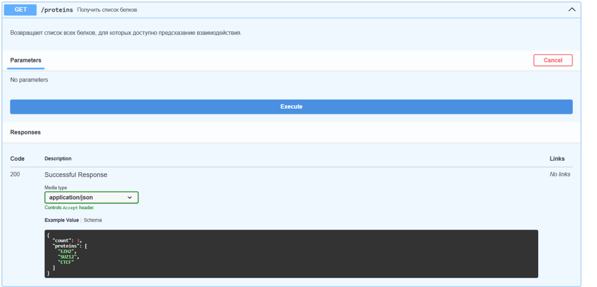
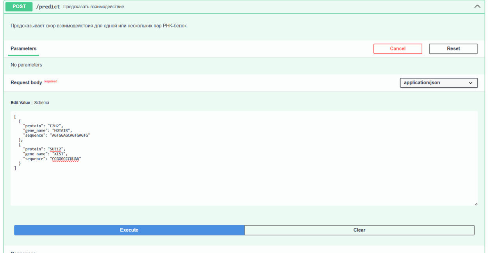
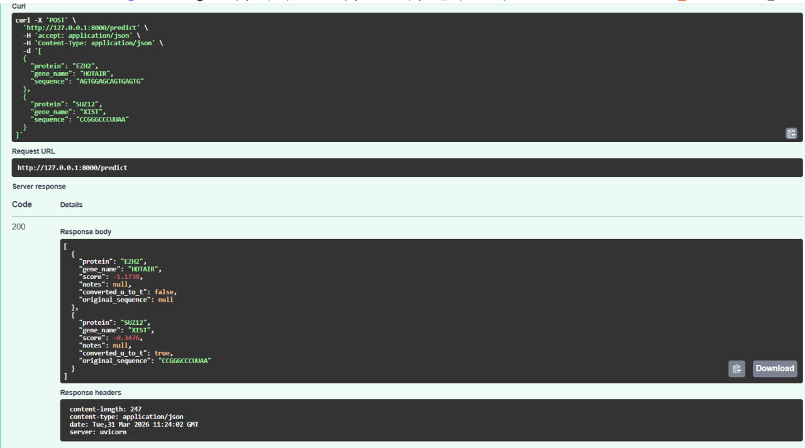

# Задание 1
	Для выполнения данного задания был написан скрипт **./hw2/wikipedia_artickles.py**, подсчёт запускался для статьи 
*https://en.wikipedia.org/wiki/Molecular_docking* с помощью команды * nohup python3 wikipedia_articles.py --url "https://en.wikipedia.org/wiki/Molecular_docking" --depth 3 > crawler2.log 2>&1 &*, 
также в **./hw2/count_links.py** я посмотрела количство ссылок для моей статьи - 94, я запустила с глубиной 3, так как с глубиной 5 выполнялся слишком долго. 
	Мой скрипт на глубине 3 отрабатывает очень долго, почти 24 часа и всё еще не отработал к сожалению и не выдал json, поэтому у меня в директории будет просто два скрипта 
	для поиска статьи и для формирования графа **./hw2/draw_wiki.py**.
	Вывод перенапрвлялся в *crawler.log*, и процесс запускался с помощью nohub(чтобы при закрытии командной строки продолжался подсчёт). Может уже после дедлайна когда скрипт доработает
        я смогу построить граф.
	На данный момент в crawler2.log у меня примерно 41 тысяча записей.

# Задание 3
Для выполнения данного задания был написал скрипт **./hw2/get_domains.py**. На выходе получился **.hw2/domains.json**.
Для InterPro API Pfam использовался базовый url **https://www.ebi.ac.uk/interpro/api/**
	 */protein/uniprot/{uniprot_id}/entry/pfam* - Прямое получение всех Pfam доменов для белка 
	
	При этом работа скрипта выполняется следующим образом: 
	1. Первый запрос к */protein/uniprot/{uniprot_id}/entry/pfam* возвращает metadata с полем *entries_url*
        2. Второй запрос по *entries_url* получает список Pfam доменов
        3. Из ответа извлекаются названия доменов из *results[].metadata.name*

	Далее поля ответы были такими: 
	*entries_url* - URL для получения списка Pfam записей
	*results[].metadata.name* - название Pfam домена
	*results[].metadata.accession* - PFAM ID (например, PF00096)

	Прямая фильтрация по Pfam на уровне API снижает объем передаваемых данных, и это, соответсвенно упрощает работую

        Результат выполнения: 
	Results saved to domains.json
	**Statistics:**
        ** - Top cell line: K562**
        ** - TF proteins found: 23**
        ** - Mapped to UniProt: 23**
        ** - Proteins with domains: 18**
        ** - Total Pfam domains found: 30**, или, если описать чуть понятнее:
  	

	K562 - клеточная линия эритролейкемии человека, широко используется в ENCODE как модельная система ,
	23 транскрипционных фактора найдены с ChIP-seq данными, 100% успешный маппинг gene symbols -> UniProt ID,
	18 из 23 белков (78%) содержат Pfam-аннотированные домены, 
	обнаружено 30 Pfam доменов (у некоторых белков по несколько доменов)

# Задание 6
	Мною был реализован FastAPI сервер RPI_server.py для предсказания взаимодействия РНК и белка. Сервер загружает JSON-файл с мотивами и скорами для 20 белков и предоставляет REST API

	
1. GET /proteins - Возвращает список белков, для которых доступно предсказание.

2. POST /predict - Предсказывает скор взаимодействия для одной или нескольких пар РНК-белок.

3. 3. GET /health (дополнительный) - Для проверки состояния сервера

Для запроса исользовала:

[
  {
    "protein": "EZH2",
    "gene_name": "HOTAIR",
    "sequence": "AGTGGAGCAGTGAGTG"
  },
  {
    "protein": "SUZ12",
    "gene_name": "XIST",
    "sequence": "CCGGGCCCUUA"
  }
]

Скрипт **./hw2/data_generator.py** создаёт JSON-файл с мотивами и скорами для 20 белков из ENCODE, а в **./hw2/data** лежат сгенерированные данные.

**Скриншоты**:

